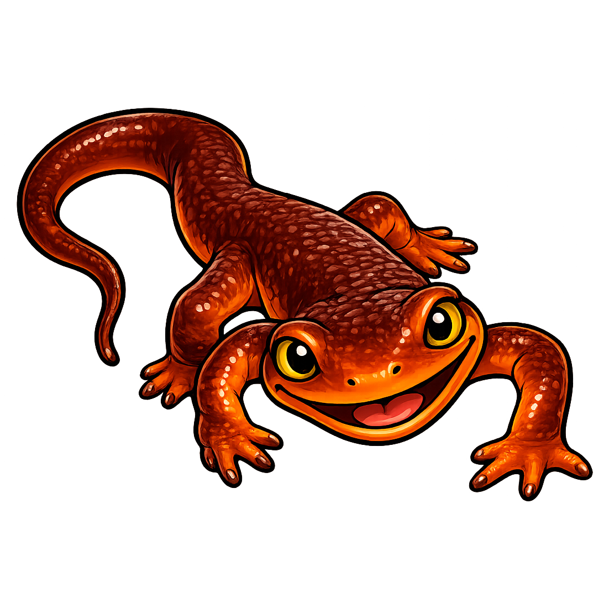

# newtui

> **Terminal UI components you can drive in isolation — interactive ones and
> the charts they sit beside.**

Two families, one crate:

- **Components** are interactive: a state machine over keys. A settings panel,
  a chooser, a form, a pager.
- **Widgets** are display: a pure function from data to cells. A sparkline, a
  butterfly meter, a heat bar, a gauge.

Both are tested the same way — not by scripting the path you thought of, but by
walking **everything reachable** and checking what must always be true.

It is the workbench, not the workshop. It decodes no keys, owns no terminal,
renders nothing by default, and performs no effect. Components describe; hosts
draw and act.

## Where this is going

A **Grafana you can drive from a terminal**: dashboards of live panels, keyboard
navigable, over data sources you bring. The pieces that get there are a chart
vocabulary that renders honestly at eight columns wide, an interaction model
that never strands the operator, and a component suite proven against every
state it can reach rather than the three someone demoed.

## Interactive: three declarations, no I/O

```rust
use newtui::{Component, Flow, Fingerprint, Key, Row, View};

struct Volume { level: u8 }

impl Component for Volume {
    fn handle(&mut self, key: Key) -> Flow {
        match key {
            Key::Left => { self.level = self.level.saturating_sub(10); Flow::Stay }
            Key::Right => { self.level = (self.level + 10).min(100); Flow::Stay }
            Key::Enter => Flow::Close(true),
            Key::Esc => Flow::Close(false),
            _ => Flow::Stay,
        }
    }

    fn view(&self) -> View {
        View::titled("volume").row(Row::new("level", self.level.to_string()).adjustable())
    }

    fn fingerprint(&self) -> Fingerprint { Fingerprint::of_view(&self.view()) }
}
```

### Exhaustive, and the counterexample is minimal for free

```rust
let report = Explorer::new(Key::navigation())
    .explore(|| Volume { level: 50 }, &[
        &properties::selection_is_always_in_range(),
        &properties::escape_always_closes_without_applying(),
        &properties::only_adjustable_rows_move(),
    ]);

assert!(report.violations.is_empty(), "{report}");
```

Two properties of the search matter more than the word *exhaustive*:

**It walks states, not paths.** Deduplicating on a fingerprint turns
`keys^depth` sequences into the handful of states a component can actually be
in. An eleven-position dial with four keys is 44 transitions, not a
combinatorial explosion.

**Breadth-first means the first path to a violation is the shortest one.** A
failure reports the minimal key sequence that reaches it, by construction —
there is no shrinking step to trust, tune, or wait for.

## Properties are data

An acceptance property is a named check over a state or a transition. The
library ships the ones every component of this shape needs — the selection
stays in range, a non-adjustable row never moves under an arrow, Esc always
leaves without applying, a repeated key clamps rather than wraps. Your
component adds its own by writing a closure, not a test file.

That is what makes the corpus portable. A property is a claim about
*observable behaviour*, so it outlives the implementation that first satisfied
it — and a reimplementation in another language, another framework, or another
agent's codebase can be held to exactly the same set.

## Leaf by construction

At `--no-default-features` this crate's resolved dependency closure is
**empty**, and `tests/leaf.rs` asserts it rather than this paragraph claiming
it. Rendering lives behind the optional `ratatui` feature; a headless consumer
drives components and inspects views without compiling a terminal backend.

That is not tidiness. It is what lets one component suite be shared across
several harnesses — including ones with no terminal at all.

## Layout

| Path | What |
|---|---|
| `src/` | the core: keys, views, the component seam, properties, the explorer |
| `demos/` | one recorded terminal demo per component, and the tapes that produce them |
| `examples/python/` | driving the components from Python |
| `docs/` | the logo, and design notes |

## License

Apache-2.0.
