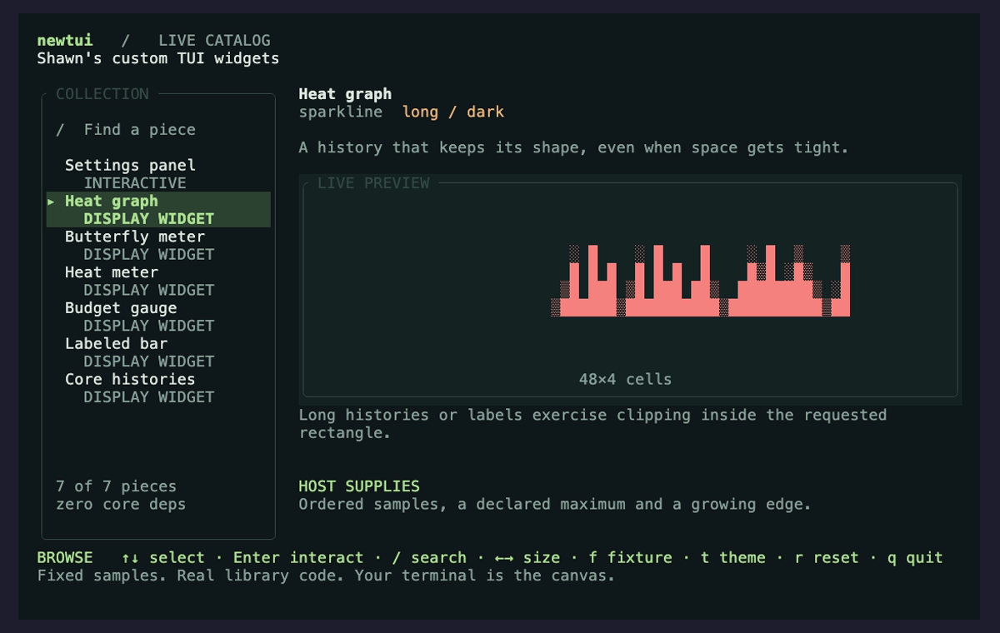

# newtui

**Shawn's custom TUI widgets.**

Controls, charts, and workspace panels developed for Shawn's TUI harnesses,
being collected into a reusable Rust library.

**[Browse the widget catalog →](docs/WIDGETS.md)**

[](docs/WIDGETS.md)

- **Controls:** settings panels, choosers, and configuration editors.
- **Charts:** heat graphs, butterfly meters, heat bars, gauges, and machine cards.
- **Workspace:** split panes, trees, tabs, linked previews, and changeset review.

Bring your data and terminal host. Widgets describe what to show; your harness
handles drawing, input, and effects. The core has no runtime dependencies by
default.

## Status

The library ships a settings component, six chart widgets, the state explorer,
an optional ratatui adapter and Python bindings. The catalog distinguishes these
from donor and planned components. Every shipped piece has an animated demo.

Explore the real widgets from this checkout:

```sh
just catalog
just catalog --item butterfly --scenario narrow
```

The catalog is an optional host; your application only needs the library.
Use `just catalog-capture` to reproduce the screenshots and recordings.

## Use the core

```sh
cargo add newtui --git https://github.com/Gilamonster-Foundation/newtui
```

Implement [`Component`](src/component.rs) to handle keys and return a
[`View`](src/view.rs). Use [`Explorer`](src/explore.rs) and
[`properties`](src/property.rs) to check behavior without opening a terminal.
Exploration covers the supplied keys and states distinguished by your
fingerprint; `report.is_clean()` also requires the search to finish within its
limits.

Hosts can pass `Key::Other` (`Key.OTHER` in Python) for an unmapped key whose
arrival matters, such as declining a confirmation. Include it in the explorer's
alphabet when claiming that behavior; `Key::navigation()` remains the six
navigation and close keys.

A component is three declarations over keys, with no I/O. This block is a
doctest, so it compiles and runs on every `cargo test` — an example nobody
compiles is a claim, not a check.

```rust
use newtui::{properties, Component, Explorer, Fingerprint, Flow, Key, Row, View};

struct Volume { level: u8 }

impl Component for Volume {
    fn handle(&mut self, key: Key) -> Flow {
        match key {
            Key::Left => { self.level = self.level.saturating_sub(10); Flow::Stay }
            Key::Right => { self.level = (self.level + 10).min(100); Flow::Stay }
            Key::Enter => Flow::Close(true),
            Key::Esc => Flow::Close(false),
            _ => Flow::Stay,
        }
    }

    fn view(&self) -> View {
        View::titled("volume")
            .row(Row::new("level", self.level.to_string()).adjustable().selected())
    }

    fn fingerprint(&self) -> Fingerprint { Fingerprint::of_view(&self.view()) }
}

let report = Explorer::new(Key::navigation())
    .explore(|| Volume { level: 50 }, &[
        &properties::selection_is_always_in_range(),
        &properties::escape_always_closes_without_applying(),
        &properties::only_adjustable_rows_move(),
    ]);

assert!(report.is_clean(), "{report}");
```

[Development plan](docs/PLAN.md) · Rust 1.88+ · [Apache-2.0](LICENSE)
