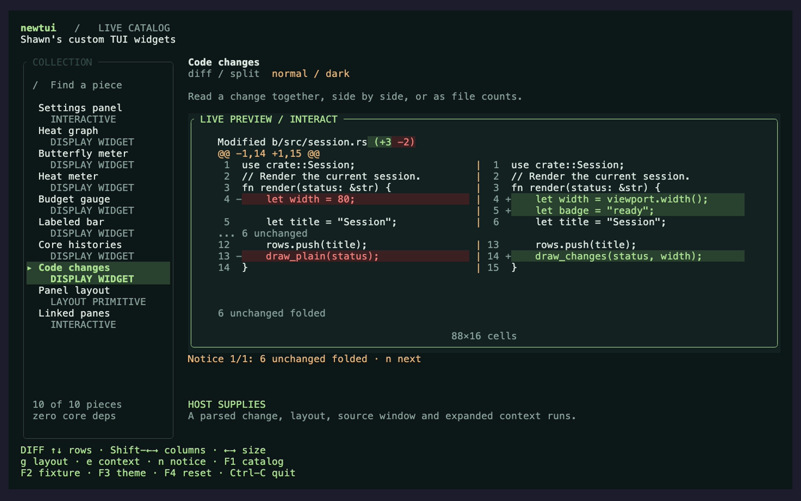

# Widget catalog

Shawn's custom TUI widgets, developed in his terminal harnesses and being
collected into a reusable Rust library.

**Available in newtui:** the settings panel; sparkline, butterfly, heat meter,
gauge, bar, core grid and diff display; ratio BSP panel geometry; the optional
ratatui adapter; Python bindings; and the
[component API](../src/component.rs), [view data](../src/view.rs) and
[state explorer](../src/explore.rs).
**Additional widget sources** are included in this repository for the remaining extractions.
**Planned widgets** describe additions that have not landed in this library.

This is the front door — what is available, included as source, or planned. For the
deep inventory of what the crate actually ships today, with per-component
acceptance properties and runnable examples, see the [component, widget, and layout
catalogue](CATALOG.md); for how components and widgets are both tested, the
[testing model](testing-model.md).

## Edited files

The [diff widget](diff-widget.md) presents unified hunks, split old/new panes,
and file statistics from the same supplied change. It includes source line
numbers, context folding and exact notices when content cannot fit. Original
text remains available in the [model's Markdown face](diff-model.md).
Open the `diff` entry in the live catalog to try geometry, folding and scrolling.

Launch `cargo run -p newtui-catalog -- --item diff --width 88`. The same
recording also shows [unified hunks](widgets/generated/diff-unified.png),
[file statistics](widgets/generated/diff-stat.png),
[Unicode and overflow notices](widgets/generated/diff-unicode.png), and
[a one-column preview with complete notices outside it](widgets/generated/diff-tiny.png).
The [animated walkthrough](../demos/catalog/diff.gif) and
[recording inputs](widgets/generated/CAPTURES.md) come from this running host.

## Panel geometry

The [BSP layout primitive](layout.md) places panes using stored ratios, so an
80/20 split returns to the same rectangles after shrinking and restoring the
terminal. Hosts receive divider paths and the IDs of panes whose geometry
changed. Pane content and navigation remain host responsibilities.

Launch `just catalog --item bsp --width 88` to change ratios, select a divider,
and try shrink/restore. [Narrow geometry](widgets/generated/bsp-narrow.png),
[rejected nonfinite edits](widgets/generated/bsp-error.png), and the
[recorded interaction](../demos/catalog/bsp.gif) use the same host.
[Recording inputs](widgets/generated/BSP-CAPTURES.md) accompany the images.
This delivers package F's geometry prerequisite; dashboard composition and
Gilamonster cockpit adoption remain planned.

## Featured: heat graphs and meters

Compact, colored charts built around the `░▒█` glyphs.

This is the running catalog, drawing newtui's own builders with reproducible
host data. Launch `just catalog` from the repository, select a piece, and try
its normal, narrow, empty, invalid-data or long-content scenario. Enter moves
into the preview; the catalog's help shows how to return to browsing.

Capture it with `just catalog-capture`. The [recording inputs](widgets/generated/CAPTURES.md)
fix the fixtures, palette, font and viewport. [Light palette](widgets/generated/catalog-light.png)
and [narrow terminal](widgets/generated/catalog-narrow.png) captures come from
the same render path. The [animated walkthrough](../demos/catalog/catalog.gif)
shows the meter family; individual behavior demos remain in the catalogue.
The [unavailable backend](widgets/generated/catalog-error.png) fixture keeps
the active model visible and explains why its dial cannot move.

| Widget | What makes it useful | Library source |
|---|---|---|
| Heat graph | Rolling history across several rows, with color indicating each sample's intensity | [`sparkline`](../src/widget/sparkline.rs) |
| Mirrored history | Normal and inverted graphs compose into opposing histories for two related series | [`SparkDirection`](../src/widget/sparkline.rs) |
| Heat meter | A single row with a positional color gradient, a label, and a value | [`heat_meter`](../src/widget/heat_meter.rs) |
| Labeled bar | A compact amount or percentage with units or a custom value label | [`bar`](../src/widget/bar.rs) |
| Per-core history | One compact history and current value per core; generalize to any named series | [`core_grid`](../src/widget/core_grid.rs) |

## Machine cards

A machine card composes those graphs and meters. Its layout should describe
the hardware, rather than name the computer it was first drawn on.

| Proposed variant | Shows | Extraction status |
|---|---|---|
| Machine card | CPU, system memory, storage, and network activity | [Implementation included](../widget-sources/metrics.rs); reusable API next |
| GPU machine card, separate memory | CPU and GPU activity, with separate system-memory and device-memory charts | [Implementation included](../widget-sources/metrics.rs); generalize its name and inputs |
| GPU machine card, unified memory | CPU and GPU activity around one shared memory-capacity chart | Planned variant of the GPU card |

A **DGX preset** can select the capabilities and memory layout appropriate to
that machine. It is a preset of the GPU card, not a separate widget family.
Unified memory must show the shared pool once; show CPU/GPU attribution only
when the supplied measurements support it.

The host supplies identity, capabilities, metrics, histories, and memory pools.
See the [machine-card extraction design](PLAN.md#machine-cards-describe-capabilities).

## More widgets

The [complete implementation sources](../widget-sources/README.md) are included
here. Butterfly and gauge already have reusable library APIs; the remaining
rows have source available and are being adapted into the library.

| Widget | Use it for | Source |
|---|---|---|
| Butterfly meter | Two rate bars around a center divider, with shared scaling and rate labels | [`butterfly`](../src/widget/butterfly.rs) |
| Activity heat row | Compress a history of counts into a row of density glyphs | [`build_heatrow_commits`](../widget-sources/swarm.rs) |
| Status history | Scan pass, fail, running, and cancelled results as colored cells | [`build_heatrow_status`](../widget-sources/swarm.rs) |
| Budget gauge | Compare spending or consumption against a limit | [`gauge`](../src/widget/gauge.rs) |
| Animated character | Give a harness an expressive ASCII companion with activity states and reaction text | [`character::draw`](../widget-sources/character.rs) |
| Resource table | Scroll through measured entities with sorting, filters, and formatted columns | [Process and pod tables](../widget-sources/machine_tab.rs) |
| Adaptive metrics list | Fit multiple entities using expanded graphs or compact meter rows | [`summary_layout`](../widget-sources/metrics.rs) |
| Scrollbar | Show a list position in one column | [`draw_scrollbar`](../widget-sources/metrics.rs) |

## Controls from Newt

The [Newt TUI refactor][newt] supplies another set of donor components.
The generic settings component is available in newtui; the remaining controls
below are donors for future extraction.

| Donor component | Use it for | Source |
|---|---|---|
| Settings panel (extracted) | Navigate rows, step bounded values, apply or cancel | [`settings_panel.rs`][settings] |
| Backend chooser | Select and configure a provider or connection | [`backend_panel.rs`][backend] |
| Configuration editor | Edit host-supplied values while the host performs writes | [`config_panel.rs`][config] |
| Transcript pager | Navigate messages and fold long output | [`transcript_pager.rs`][pager] |
| Tab strip | Lay out and select open sessions | [`tab_bar.rs`][tabs] |

The [extraction plan](PLAN.md#package-a--move-settings_panel-across-first-blocks-c-e)
starts with settings. The included [settings-list implementation](../widget-sources/settings.rs)
also has text fields, checkboxes, option cycling, and scrolling.

## Planned workspace widgets

| Widget | Use it for | Plan |
|---|---|---|
| Split panes | Proportional cockpit layouts with host-driven divider resizing | [F](PLAN.md#package-f--the-dashboard-layer-needs-b) |
| Mermaid diagram | Render diagrams beside terminal work, with overflow reporting | [I](PLAN.md#package-i--the-mermaid-widget-needs-b) |
| Linked two-pane | Link scrolling and selection across a diff or edit/preview | [J](PLAN.md#package-j--the-linked-two-pane-needs-f) |
| Tree | Browse files, outlines, or nested data without losing the cursor | [K](PLAN.md#package-k--the-tree-needs-a) |
| Document tabs | Track document order, neighboring focus, and dirty state | [L](PLAN.md#package-l--the-tabbed-document-container-needs-f) |
| Changeset review | Select files and hunks; request stage, unstage, discard, or commit | [M](PLAN.md#package-m--the-changeset-review-surface-needs-j-k) |

Split-pane geometry has a donor in `gilamonster-agent`; its extraction includes
a switch to proportional sizing. Newt's session tab strip is a donor for the
visual treatment; document dirty-state handling remains planned.

## As widgets land

Each entry gets an availability label, a preview from the library implementation,
a runnable example, its import and feature requirements, and an API link.
[Recorded demos](../demos/README.md) should show navigation and apply/cancel for
controls, and ordinary data plus a narrow viewport for charts.

The library calls interactive widgets **components** (`handle` + `view`).
Display widgets turn data into styled cells. Your harness supplies the data,
draws the result, and carries out requested actions.

[← README](../README.md) · [Development plan](PLAN.md)

[newt]: https://github.com/Gilamonster-Foundation/newt-agent
[settings]: https://github.com/Gilamonster-Foundation/newt-agent/blob/main/newt-tui/src/settings_panel.rs
[backend]: https://github.com/Gilamonster-Foundation/newt-agent/blob/main/newt-tui/src/backend_panel.rs
[config]: https://github.com/Gilamonster-Foundation/newt-agent/blob/main/newt-tui/src/config_panel.rs
[pager]: https://github.com/Gilamonster-Foundation/newt-agent/blob/main/newt-tui/src/transcript_pager.rs
[tabs]: https://github.com/Gilamonster-Foundation/newt-agent/blob/main/newt-tui/src/tab_bar.rs
