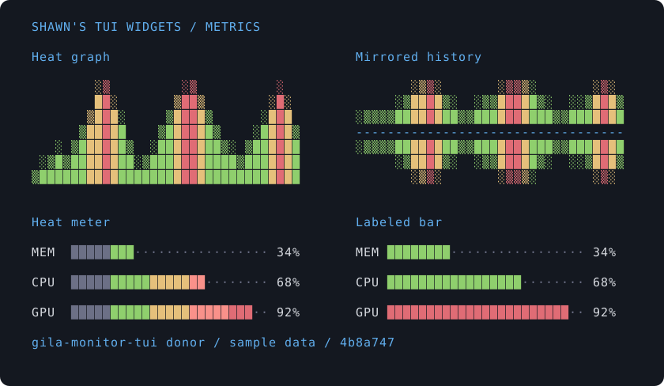

# Widget catalog

Shawn's custom TUI widgets, developed in his terminal harnesses and being
collected into a reusable Rust library.

**Available in newtui:** the [component API](../src/component.rs),
[view data](../src/view.rs), and [state explorer](../src/explore.rs).
**Donor widgets** below exist in the linked harnesses and await extraction here.
**Planned widgets** describe additions that have not landed in this library.

## Featured: heat graphs and meters

Shawn's favorites from [gila-monitor-tui's metrics module][metrics].
Compact, colored charts built around the `░▒█` glyphs.

This preview uses the donor's drawing functions with sample data, captured at
[`4b8a747`](https://github.com/hartsock/gilabot/commit/4b8a7470a78226f62a82bab40a6738ae2d7ee048).
It shows existing donor behavior, not a newtui rendering API.

| Donor widget | What makes it useful | Source |
|---|---|---|
| Heat graph | Rolling history across several rows, with color indicating each sample's intensity | [`draw_graph`][heat-graph] |
| Mirrored history | Normal and inverted graphs compose into opposing histories for two related series | [`draw_graph_inverted`][inverted-graph] |
| Heat meter | A single row with a positional color gradient, a label, and a value | [`draw_heat_meter`][heat-meter] |
| Labeled bar | A compact amount or percentage with units or a custom value label | [`draw_bar_line` / `draw_bar_with_label`][labeled-bar] |
| Per-core history | One compact history and current value per core; generalize to any named series | [`draw_cpu_cores`][core-history] |

## Machine cards

A machine card composes those graphs and meters. Its layout should describe
the hardware, rather than name the computer it was first drawn on.

| Proposed variant | Shows | Extraction status |
|---|---|---|
| Machine card | CPU, system memory, storage, and network activity | Donor: [`draw_machine_cell`][machine-card] |
| GPU machine card, separate memory | CPU and GPU activity, with separate system-memory and device-memory charts | Donor: [the GPU-machine cell][gpu-card]; generalize its name and inputs |
| GPU machine card, unified memory | CPU and GPU activity around one shared memory-capacity chart | Planned variant of the GPU card |

A **DGX preset** can select the capabilities and memory layout appropriate to
that machine. It is a preset of the GPU card, not a separate widget family.
Unified memory must show the shared pool once; show CPU/GPU attribution only
when the supplied measurements support it.

The host supplies identity, capabilities, metrics, histories, and memory pools.
See the [machine-card extraction design](PLAN.md#machine-cards-describe-capabilities).

## More donor widgets

These also exist in [gila-monitor-tui's UI modules][gila-ui].

| Widget | Use it for | Source |
|---|---|---|
| Butterfly meter | Two rate bars around a center divider, with shared scaling and rate labels | [`build_net_butterfly_line`][butterfly] |
| Activity heat row | Compress a history of counts into a row of density glyphs | [`build_heatrow_commits`][activity] |
| Status history | Scan pass, fail, running, and cancelled results as colored cells | [`build_heatrow_status`][status] |
| Budget gauge | Compare spending or consumption against a limit | [`draw_gauge`][gauge] |
| Animated character | Give a harness an expressive ASCII companion with activity states and reaction text | [`character::draw`][character] |
| Resource table | Scroll through measured entities with sorting, filters, and formatted columns | [Process and pod tables][resource-table] |
| Adaptive metrics list | Fit multiple entities using expanded graphs or compact meter rows | [`summary_layout`][summary-layout] |
| Scrollbar | Show a list position in one column | [`draw_scrollbar`][scrollbar] |

## Controls from Newt

The [Newt TUI refactor][newt] supplies another set of donor components.
They are not yet available as newtui widgets.

| Donor component | Use it for | Source |
|---|---|---|
| Settings panel | Navigate rows, step bounded values, apply or cancel | [`settings_panel.rs`][settings] |
| Backend chooser | Select and configure a provider or connection | [`backend_panel.rs`][backend] |
| Configuration editor | Edit host-supplied values while the host performs writes | [`config_panel.rs`][config] |
| Transcript pager | Navigate messages and fold long output | [`transcript_pager.rs`][pager] |
| Tab strip | Lay out and select open sessions | [`tab_bar.rs`][tabs] |

The [extraction plan](PLAN.md#package-a--move-settings_panel-across-first-blocks-c-e)
starts with settings. A separate [settings-list donor][gila-settings] in
gila-monitor-tui includes text fields, checkboxes, option cycling, and scrolling.

## Planned workspace widgets

| Widget | Use it for | Plan |
|---|---|---|
| Split panes | Proportional cockpit layouts with host-driven divider resizing | [F](PLAN.md#package-f--the-dashboard-layer-needs-b) |
| Mermaid diagram | Render diagrams beside terminal work, with overflow reporting | [I](PLAN.md#package-i--the-mermaid-widget-needs-b) |
| Linked two-pane | Link scrolling and selection across a diff or edit/preview | [J](PLAN.md#package-j--the-linked-two-pane-needs-f) |
| Tree | Browse files, outlines, or nested data without losing the cursor | [K](PLAN.md#package-k--the-tree-needs-a) |
| Document tabs | Track document order, neighboring focus, and dirty state | [L](PLAN.md#package-l--the-tabbed-document-container-needs-f) |
| Changeset review | Select files and hunks; request stage, unstage, discard, or commit | [M](PLAN.md#package-m--the-changeset-review-surface-needs-j-k) |

Split-pane geometry has a donor in `gilamonster-agent`; its extraction includes
a switch to proportional sizing. Newt's session tab strip is a donor for the
visual treatment; document dirty-state handling remains planned.

## As widgets land

Each entry gets an availability label, a preview from the library implementation,
a runnable example, its import and feature requirements, and an API link.
[Recorded demos](../demos/README.md) should show navigation and apply/cancel for
controls, and ordinary data plus a narrow viewport for charts.

The library calls interactive widgets **components** (`handle` + `view`).
Display widgets turn data into styled cells. Your harness supplies the data,
draws the result, and carries out requested actions.

[← README](../README.md) · [Development plan](PLAN.md)

[metrics]: https://github.com/hartsock/gilabot/blob/main/gila-monitor-tui/src/ui/metrics.rs
[gila-ui]: https://github.com/hartsock/gilabot/tree/main/gila-monitor-tui/src/ui
[heat-graph]: https://github.com/hartsock/gilabot/blob/4b8a7470a78226f62a82bab40a6738ae2d7ee048/gila-monitor-tui/src/ui/metrics.rs#L467
[inverted-graph]: https://github.com/hartsock/gilabot/blob/4b8a7470a78226f62a82bab40a6738ae2d7ee048/gila-monitor-tui/src/ui/metrics.rs#L523
[heat-meter]: https://github.com/hartsock/gilabot/blob/4b8a7470a78226f62a82bab40a6738ae2d7ee048/gila-monitor-tui/src/ui/metrics.rs#L237
[labeled-bar]: https://github.com/hartsock/gilabot/blob/4b8a7470a78226f62a82bab40a6738ae2d7ee048/gila-monitor-tui/src/ui/metrics.rs#L590
[core-history]: https://github.com/hartsock/gilabot/blob/4b8a7470a78226f62a82bab40a6738ae2d7ee048/gila-monitor-tui/src/ui/metrics.rs#L83
[machine-card]: https://github.com/hartsock/gilabot/blob/4b8a7470a78226f62a82bab40a6738ae2d7ee048/gila-monitor-tui/src/ui/metrics.rs#L280
[gpu-card]: https://github.com/hartsock/gilabot/blob/4b8a7470a78226f62a82bab40a6738ae2d7ee048/gila-monitor-tui/src/ui/metrics.rs#L51
[summary-layout]: https://github.com/hartsock/gilabot/blob/4b8a7470a78226f62a82bab40a6738ae2d7ee048/gila-monitor-tui/src/ui/metrics.rs#L773
[scrollbar]: https://github.com/hartsock/gilabot/blob/4b8a7470a78226f62a82bab40a6738ae2d7ee048/gila-monitor-tui/src/ui/metrics.rs#L1199
[butterfly]: https://github.com/hartsock/gilabot/blob/4b8a7470a78226f62a82bab40a6738ae2d7ee048/gila-monitor-tui/src/ui/swarm.rs#L452
[activity]: https://github.com/hartsock/gilabot/blob/4b8a7470a78226f62a82bab40a6738ae2d7ee048/gila-monitor-tui/src/ui/swarm.rs#L265
[status]: https://github.com/hartsock/gilabot/blob/4b8a7470a78226f62a82bab40a6738ae2d7ee048/gila-monitor-tui/src/ui/swarm.rs#L295
[gauge]: https://github.com/hartsock/gilabot/blob/4b8a7470a78226f62a82bab40a6738ae2d7ee048/gila-monitor-tui/src/ui/budget.rs#L58
[character]: https://github.com/hartsock/gilabot/blob/4b8a7470a78226f62a82bab40a6738ae2d7ee048/gila-monitor-tui/src/ui/character.rs#L269
[resource-table]: https://github.com/hartsock/gilabot/blob/4b8a7470a78226f62a82bab40a6738ae2d7ee048/gila-monitor-tui/src/ui/machine_tab.rs#L357
[gila-settings]: https://github.com/hartsock/gilabot/blob/4b8a7470a78226f62a82bab40a6738ae2d7ee048/gila-monitor-tui/src/ui/settings.rs#L885
[newt]: https://github.com/Gilamonster-Foundation/newt-agent
[settings]: https://github.com/Gilamonster-Foundation/newt-agent/blob/main/newt-tui/src/settings_panel.rs
[backend]: https://github.com/Gilamonster-Foundation/newt-agent/blob/main/newt-tui/src/backend_panel.rs
[config]: https://github.com/Gilamonster-Foundation/newt-agent/blob/main/newt-tui/src/config_panel.rs
[pager]: https://github.com/Gilamonster-Foundation/newt-agent/blob/main/newt-tui/src/transcript_pager.rs
[tabs]: https://github.com/Gilamonster-Foundation/newt-agent/blob/main/newt-tui/src/tab_bar.rs
