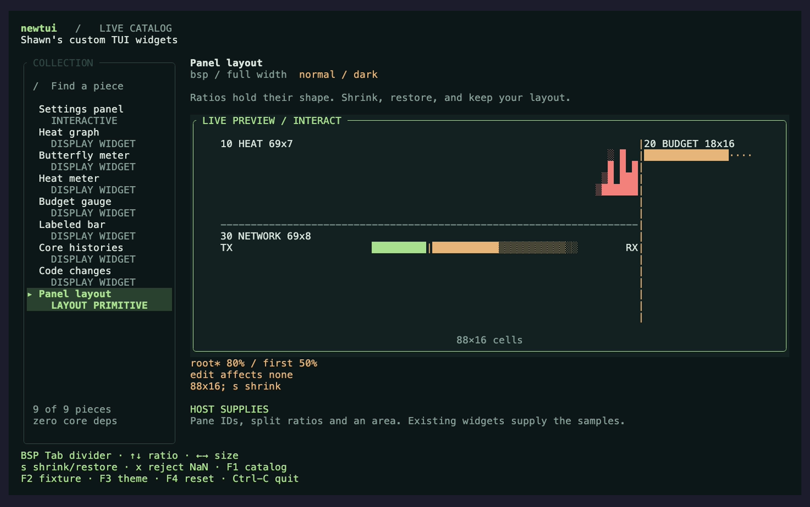

# Panel geometry

`newtui::layout::LayoutTree` derives pane rectangles from a binary tree of
ratios. A host supplies the pane IDs, terminal area, and ratio edits. The
library stores only those IDs, topology, and ratios. It has no pane contents,
data source, terminal, focus, mouse event, or resize timer.

This is the geometry prerequisite for package F. Dashboard composition,
navigation, data sources, and adoption in Gilamonster's cockpit remain later
work; this slice does not complete package F.

Launch `just catalog --item bsp --width 88`. Enter focuses the preview; Tab
selects the root or first-child divider, up/down changes its ratio, `s`
shrinks/restores the available width, and `x` attempts a rejected NaN edit.
The same host shows [narrow geometry](widgets/generated/bsp-narrow.png) and
[a rejected edit](widgets/generated/bsp-error.png). The
[catalog animation](../demos/catalog/bsp.gif) and
[named behavior demo](../demos/bsp.gif) come from the running hosts; their
[catalog inputs](widgets/generated/BSP-CAPTURES.md) and
[demo inputs](../demos/captures/bsp.md) record the actual tapes and recorder.

## Splitting and resizing

`single(id)` starts with an existing host locator. `split(target, new_id,
direction, ratio)` keeps the target pane in the first child and puts `new_id`
in the second. Unknown targets, duplicate IDs, and nonfinite ratios return
false without changing the tree. IDs are `usize` locators: the crate does not
mint, hash, or allocate identities.

Finite ratios clamp to `MIN_RATIO = 0.1` through `MAX_RATIO = 0.9`. Each
nonzero split extent reserves one divider cell. The first child receives
`floor(remaining_cells * ratio)` cells; the second receives the remainder.
Multiplication uses the stored `f32` proportion before the final floor. Every
`u16` extent is exactly representable in `f32`; ratios are not widened and no
epsilon is added. Ten available cells at 0.9 therefore split into nine and
one; at 0.7, seven and three. The immediately smaller representable ratios
yield eight and two, and six and four, respectively. The stored ratio itself
never changes during projection.

An 80/20 split at 200 columns yields widths `[159, 40]`. At 100 columns it
yields `[79, 20]`. Restoring 200 yields exactly `[159, 40]` again. A rounded
cell count is never used to reconstruct the original ratio.

`Horizontal` places children left/right, with a vertical divider. `Vertical`
places them above/below, with a horizontal divider. `rects(area)` returns
every leaf in first-child order, including zero-size panes.

## Coordinate and divider boundaries

`Rect` uses half-open edges bounded by `u16::MAX`. Projection clips width to
`u16::MAX - x` and height to `u16::MAX - y`; an origin at `u16::MAX` has no
usable extent on that axis. No coordinate wraps, and no child extends beyond
its normalized parent. Zero-width or zero-height rectangles have no cells.

At one column, a horizontal split uses that column for its divider and leaves
both children zero columns wide. At two columns, it leaves zero and one
columns for the children at ratio 0.5. Topology never disappears because the
terminal is too small.

`splits(area)` returns one `SplitBorder` per structural split in preorder.
Each border carries its current ratio, normalized node area, divider position,
and root-to-node path (`false` first, `true` second). Empty areas retain their
paths but have no hittable divider. Hosts must check the area before pointer
hit testing and refresh projected paths after a topology edit.

`set_ratio_at(path, ratio)` returns true for any accepted split path, even if
the ratio or resulting cell rectangles stay the same. Leaf paths, nonexistent
paths, NaN, and infinities return false without modifying any node. The host
decodes pointer coordinates; the core receives only the resulting ratio.

## Reflow only affected panes

Save `before = layout.rects(area)`, apply a ratio or terminal-size change, and
derive `after`. `changed_panes(&before, &after)` returns sorted IDs whose
rectangles changed, appeared, or disappeared. Each projection must contain
at most one rectangle per ID, as `rects` guarantees. Pair ordering is ignored.

A ratio edit may round to the same cells and produce an empty changed set.
Changing an inner split leaves the other subtree untouched. The host can
reflow affected visible panes immediately and defer other work with its own
timer or cache policy. Content changes are outside this geometry comparison.

## Executed proof boundary

`tests/layout.rs` checks exact shrink/restore rectangles, nested paths on both
sides, clamping and invalid edits, tiny areas, extreme coordinates, and exact
changed-pane IDs. An independent partition check requires bounded, disjoint
leaf rectangles plus the declared one-cell dividers to cover the parent.

A test-only `Component` adapter bounds continuous input to five ratios:
`min`, the next representable value above `min`, `0.5`, the value immediately
below `max`, and `max`. It explores two split selectors and seven area choices,
for 350 states in each of horizontal/vertical and vertical/horizontal trees.
Both walks require zero violations, `exhausted: true`, and the exact state
count. Fingerprints contain selector indices and ratio bits, never content.
Separate tests cover finite values outside the band and nonfinite inputs.

`tests/mutations.rs` executes defects that widen ratio arithmetic, reuse
initial cell widths, reverse a split path, consume the divider, ignore ratio
edits, or report unchanged panes as changed. Each must fail its named guard,
rather than merely fail to compile. The bounded proof covers geometry; it says
nothing about widget content reflow or real-terminal repaint behavior.

The catalog tests independently request each existing widget and compare its
cells inside the projected pane. They cover all five fixtures, both palettes,
and four viewport/preview-size pairs, including a one-column preview in a
54-by-28 terminal. Blank pane content fails even when labels and dividers
survive. Complete ratio/path/changed-pane status is checked outside the preview.
The named demo checks all five fixtures at 88, 44, 12, and one column, including
shrink/restore and status visibility. The shared composition code owns no chart
algorithm; each pane calls an existing builder.

These are finite host fixtures, not a proof for arbitrary dashboard contents.
The demo's changed-pane caption compares its last edit at the current viewport
size. It does not measure terminal repaint latency or execute host reflow work.
The export guard treats layouts as a third category and requires each public
layout module, documented entry, launchable fixture, and named demo to agree.

## Donor provenance

The one-cell divider contract comes from
`Gilamonster-Foundation/gilamonster-agent/src/layout.rs`, last changed at
`d1b9ed84223c69c36441ed36f84263d9adef5ad5`, under Apache-2.0, copyright 2026
Shawn Hartsock / Gilamonster Foundation. Its stored absolute cell sizes and
round-robin resize algorithm are replaced with ratios here.

Binary traversal and boolean split paths are adapted from
`herdrdev/herdr/src/layout.rs` at
`09cdd88d0aca35617eb05468c2421b0467656e4f`, under its repository's Apache-2.0
license. Its terminal types, serialization, global pane allocator, focus
model, and divider-free sizing are not dependencies of this module. Attribution
is retained in the source. Herdr itself is unchanged.
